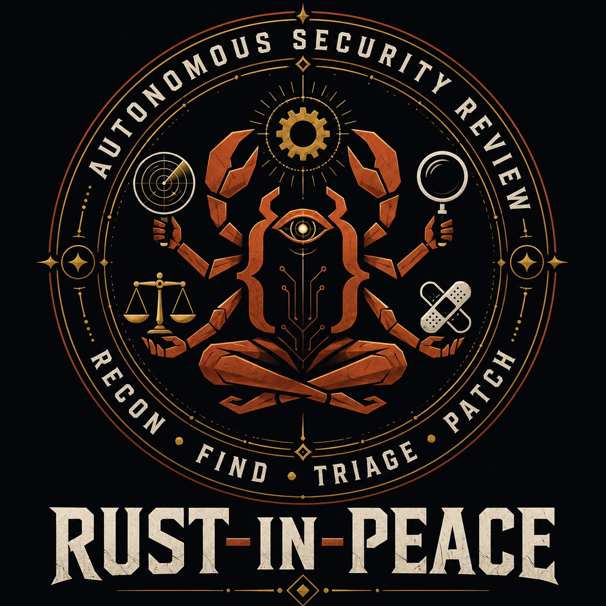

<p align="center">
  
</p>

# rust-in-peace 🦀🤘

**Agentic security review for Rust.** An autonomous
recon → find → grade → **find→fuzz** → report → patch loop for the bugs that
actually bite Rust: memory-safety in `unsafe`/FFI, panic-DoS from untrusted
input, deserialization trust (an integrity check is not a bounds check), and
`Send`/`Sync` + panic-safety soundness. A machine-readable threat model routes
the Rust crash-track admission and vote budget; the separate reattack stage
uses it for dynamic-oracle dispatch. Detectors: **Miri** (undefined behavior), **AddressSanitizer**,
**panic/abort**, **hang-timeout**, and `cargo-fuzz` for execution-verified
reproduction.

[](LICENSE)


> A Rust-security fork of Anthropic's
> [defending-code-reference-harness](https://github.com/anthropics/defending-code-reference-harness)
> (Apache-2.0) — the reference implementation for autonomous vulnerability
> discovery and remediation with Claude ([blog](https://claude.com/blog/using-llms-to-secure-source-code),
> [cookbook](https://platform.claude.com/cookbook/claude-agent-sdk-06-the-vulnerability-detection-agent)).
> Upstream is a C/C++ + ASan demo and is not maintained. This fork is
> **rust-first** — `rust` is the default profile — and keeps the upstream C/C++
> demo intact as the `cpp` profile.
> Maintained by Sergey Gordeychik ([contact](#contact)).

## What this fork adds

Upstream is a C/C++ + ASan demo. This fork keeps that intact as the `cpp` profile
and builds out a **first-class Rust security pipeline** — the profile this repo
exists for:

- **Profile registry** (`harness/profiles.py`) — the pipeline resolves its
  language/detector pieces (find/grade/judge/report/patch prompts, crash
  detector, find→fuzz binder) from a `profile:` field in `config.yaml`. Adding a
  crash-shaped language is a new `harness/<lang>/` package + one registry entry;
  a new evidence model may also require shared disposition/orchestration work.
  The registered `android-app` profile is an experimental research branch, not
  part of the supported Rust release baseline.
- **The `rust` profile** (`harness/rust/`) — a Rust find prompt, a
  Miri / AddressSanitizer / panic / hang crash detector, Rust-tuned
  grade/judge/report/patch prompts, and the Rust bug taxonomy: unsafe/FFI memory
  safety, panic-DoS, deserialization trust, and `Send`/`Sync` + panic-safety
  soundness. See [profiles/rust/README.md](profiles/rust/README.md).
- **Recall-first union-of-N** — single-run recall is noisy, so `find` runs N
  times and merges candidates by **(CWE + crash-site)** — not exact line —
  keeping every candidate ≥1 run found, tagged `votes: k/N`
  (`--runs N --aggregate union`; N defaults to a per-class **vote budget** for
  `profile: rust`). A second independent derivation of a site is the vote that
  proves it real.
- **Three seed-diverse find passes** (`/variant-scan`, "bugs travel in packs") —
  the same target is hunted three ways that converge only on the *big* bug and
  diverge on everything else: **blind** (no hint), **threat-model-first** (seeded
  from `THREAT_MODEL.md`), and **CVE/history-seeded** (each historical advisory's
  *pattern* re-hunted in the code paths its fix didn't cover). Every candidate
  then faces a **3-skeptic adversarial verify** (correctness / reachability /
  impact). The disposition it emits is *triage, not truth* — a "confirmed" vote
  still owes an independent PoC before it counts, the gate that caught false
  positives every campaign. See [docs/variant-analysis.md](docs/variant-analysis.md).
- **Capability-routed Rust execution** — `/threat-model` emits a
  machine-readable `capabilities.json` (§9) beside `config.yaml`. `run` uses it
  for the per-class vote budget and skips the autonomous byte-crash track on a
  logic-only Rust target before auth/Docker, writing an evidenced
  `routing.json`; `reattack` uses it for dynamic-oracle dispatch and
  missing-capability reporting. The remaining capability rows are an explicit
  routing specification, not a claim that every stage is automatic.
- **find→fuzz bridge** (`vuln-pipeline reattack`) — turns a static finding into a
  *reproducing* dynamic harness: `dispatch(CWE, capability) → template →
  agent-bound harness → cargo-fuzz / Miri build + validate`, so a graded
  candidate becomes an execution-verified crash. Soundness classes with no byte
  input (trait-trust, panic-safety, `Send`/`Sync`) are **DEFER-TO-DYNAMIC** and
  routed to Miri / a compile-proof / an adversarial-impl harness instead of being
  reasoned into CLEAN.
- **Scorecard discipline** (`vuln-pipeline scorecard`) — "0 bugs found" is
  forbidden output: every non-reproduction carries a `residual_reason` from a
  fixed vocabulary (`grammar-gated` / `needs-MSan` / `asan-on-C` /
  `unreachable-as-extracted` / …); a clean verdict with no reason is a discipline
  violation.
- **Honesty gates at grade** (`harness/gates.py`) — a `real` verdict must have
  its load-bearing premise *evidenced*, or it is routed to CONTESTED/UNVERIFIED
  instead of shipping: a dependency-behaviour claim needs a `file:line` citation
  into that dep (L1), a reachability claim needs a where-checked entry→sink trace
  (L3), a construction-built reproduction is UNVERIFIED until re-run through the
  real parse entry (L12), and an instrumentation-only crash (e.g. rust
  overflow-checks) must reproduce under the *shipping* build or it is
  `build_profile_gated` / R7 (L10). The gate fires automatically at grade time
  and flows through the existing aggregate path.
- **Triage with a 3-way disposition** — findings resolve to
  `real` / `real_latent` / `false_positive` under Rust FP-precedents (R1–R11);
  a real-but-unlabeled bug is a win, never counted as a false positive.
- **Adversarial pre-disclosure review** (`vuln-pipeline predisclose`) — before a
  finding is sent upstream, a skeptical-maintainer agent attacks its four
  load-bearing claims (what/where, severity, the proposed fix, the reachability
  argument) using the target's own code — catching inflated severity, a fix that
  doesn't compile, or a wrong dismissal before it goes public.
- **Worked targets + a benchmark study** — a `rust-canary` demo target
  (seeded unsafe-OOB / panic-DoS / unbounded-loop + one triage-FP decoy), and
  [`targets/dvra3-parser`](targets/dvra3-parser): a run against the
  [Damn Vulnerable Rust App](https://github.com/scadastrangelove/damn-vulnerable-rust-app)
  benchmark — blind DVRA-003 crash reproduction (the found PoC is bit-identical
  to the planted gold seed) plus a three-build recall study. The neutralized
  no-hints tree is contributed back as `dvra-3-blind`.

## Quickstart (Rust)

**Static skills — read-only, no Docker, usable today** (repo root, in Claude Code).
`/threat-model` also emits the `capabilities.json` that later routes the dynamic
stage:

```
/threat-model bootstrap <your-crate>          # → THREAT_MODEL.md §9 + capabilities.json
/vuln-scan <your-crate>/src --extra profiles/rust/scan-extras.txt
/triage VULN-FINDINGS.json --fp-rules profiles/rust/fp-rules.txt
```

**Autonomous pipeline** on a Rust target (executes code — runs sandboxed). N and
the sanitizer/fuzz rung come from `capabilities.json`; union-of-N is recall-first:

```
export CLAUDE_CODE_OAUTH_TOKEN=...       # or ANTHROPIC_API_KEY / Bedrock — see docs/agent-sandbox.md
bin/vp-sandboxed run rust-canary --parallel --stream --aggregate union   # recon → find(union) → grade → judge → report
vuln-pipeline reattack  results/rust-canary/<ts>/ --aggregate union      # find→fuzz: static finding → reproducing cargo-fuzz/Miri harness
vuln-pipeline scorecard results/rust-canary/<ts>/                        # discipline gate: no clean-without-a-residual-reason
```

Adding another crash-shaped language = a new `harness/<lang>/` package + one
`Profile` entry in `harness/profiles.py`; a new evidence model may require core
work. Full details:
[profiles/rust/README.md](profiles/rust/README.md).

> This is an open-source reference implementation for finding vulnerabilities
> with Claude — build your own pipeline on it, customize the logic, and run it
> with whatever Claude API access you have (Anthropic API, Bedrock, or Vertex).

## Contents

- **Claude Code skills**: `/quickstart`, `/threat-model`, `/vuln-scan`,
  `/variant-scan`, `/triage`, `/patch`, `/customize`: interactive scoping,
  scanning, triage, and patching. `/variant-scan` runs the three seed-diverse
  find passes (blind ∪ threat-model-first ∪ CVE/history-seeded) + a 3-skeptic
  adversarial verify — the recall engine the real-OSS campaigns used. Open this
  repo in Claude Code and run `/quickstart` to get oriented.
- **`harness/`**: the autonomous pipeline (recon → find → grade → judge →
  report, plus the `reattack` find→fuzz bridge, the `scorecard` gate, the
  `predisclose` adversarial maintainer-review, and `patch`), driven by profiles.
  Grade applies honesty gates (a `real` verdict needs its premises evidenced —
  dependency-behaviour citations, a reachability trace, a shipping-build re-test
  for instrumentation-only crashes — else it is routed to CONTESTED/UNVERIFIED). The `rust` profile finds Rust memory-safety /
  panic / soundness bugs with Miri + AddressSanitizer + cargo-fuzz; the retained
  `cpp` profile finds C/C++ memory bugs with ASan. This harness is a
  **reference, not a product** — the shape, prompts, and sandboxing are reusable,
  but it will not work on every codebase out of the box. Run `/customize` to port
  it to your language, detector, or vuln class.
- **Profiles** (`harness/profiles.py`): the pipeline selects its
  language/detector pieces (find prompt, crash detector, grade/judge/report/patch
  prompts, find→fuzz binder) by a `profile:` field in `config.yaml`. **`rust`** is
  the worked profile this fork is built around — Miri / sanitizer / panic / hang
  detectors, the Rust bug taxonomy (unsafe/FFI, panic-DoS, deserialization trust,
  `Send`/`Sync` soundness), capability-routed fuzzing, and recall-first
  union-of-N. `cpp` (C/C++ + ASan) is the retained upstream profile (a
  `config.yaml` without a `profile:` field now defaults to `rust`). See
  [profiles/rust/README.md](profiles/rust/README.md), the `targets/rust-canary`
  demo, and [`targets/dvra3-parser`](targets/dvra3-parser) (a DVRA benchmark run).
  Adding another crash-shaped language = a new `harness/<lang>/` package + one
  registry entry; evidence models unlike crashes require additional core work.

> ⚠️ **Security:** `/quickstart`, `/threat-model`, `/vuln-scan`, and `/triage`
> only read and write files. Running `/patch` on static findings (`TRIAGE.json`
> or `VULN-FINDINGS.json`) is likewise read- and write-only. `/customize` edits
> the harness code and runs validation commands. Any of these skills are safe to
> run unsandboxed, as long as you review and approve each tool use in Claude Code.
> The autonomous reference pipeline (including `/patch` on pipeline results)
> **executes target code**, so it refuses to run outside of a gVisor sandbox
> unless explicitly overridden. To get set up, run `scripts/setup_sandbox.sh` once,
> then invoke the pipeline via `bin/vp-sandboxed`. See [docs/security.md](docs/security.md)
> and [docs/agent-sandbox.md](docs/agent-sandbox.md) for more details.

## Getting Started

```bash
git clone https://github.com/scadastrangelove/rust-in-peace
cd rust-in-peace
claude

# 30-sec intro + guided first run on the canary target
> /quickstart

# Rust: scan a crate with the rust profile's brief / triage rules
> /vuln-scan path/to/crate/src --extra profiles/rust/scan-extras.txt
> /triage VULN-FINDINGS.json --fp-rules profiles/rust/fp-rules.txt
```

## Further Reading

- [**Blog post**](https://claude.com/blog/using-llms-to-secure-source-code) · Anthropic's "Using LLMs to secure source code" — the upstream methodology this fork builds on
- [**Pipeline**](docs/pipeline.md) · How it works: diagram, stages, CLI flags
- [**Security**](docs/security.md) · Sandboxing, what not to mount
- [**Agent sandbox**](docs/agent-sandbox.md) · gVisor isolation + egress allowlist for every agent
- [**Customize**](docs/customizing.md) · Port to my stack; which files change and why
- [**Rust profile**](profiles/rust/README.md) · A worked profile for Rust security (unsafe/FFI, panic-DoS, deserialization trust, `Send`/`Sync` soundness) — Miri / sanitizer / panic / hang detectors, selected with `profile: rust`
- [**Capability routing**](profiles/rust/capabilities.md) · How `capabilities.json` (threat-model §9) gates the fuzz rung, sanitizer, and per-class vote budget — an absent capability is an evidenced skip
- [**find→fuzz**](profiles/rust/find-to-fuzz.md) · Turning a static finding into a reproducing cargo-fuzz/Miri harness (dispatch → template → build + validate)
- [**DVRA benchmark run**](targets/dvra3-parser) · A worked run against Damn Vulnerable Rust App — blind DVRA-003 reproduction + a three-build recall study
- [**Patching**](docs/patching.md) · Generate and verify fixes for verified crashes
- [**Troubleshooting**](docs/troubleshooting.md) · Duplicates, rate limits, subagent model pinning
- [**Safeguards**](https://support.claude.com/en/articles/14604842-real-time-cyber-safeguards-on-claude) · Block for dangerous cyber work

---

## Ramp Up

The fastest way in is to run `/quickstart` on `rust-canary` and read the scorecard
it produces. It's tempting to spend months designing the perfect pipeline, but it's
better to start small on Day 1 and build from there as learnings come. The steps
below follow that pattern at an ambitious but reasonable pace.

|                                                                                     |              |                                                              |
|-------------------------------------------------------------------------------------|--------------|--------------------------------------------------------------|
| [Step 1](#step-1-day-1-build-a-threat-model-and-run-your-first-static-scan--triage) | **Day 1**    | Build a threat model and run your first static scan + triage |
| [Step 2](#step-2-day-2-run-the-autonomous-pipeline-on-a-target)                     | **Day 2**    | Run the autonomous pipeline on a Rust crate — or the retained cpp base on a C/C++ library | 
| [Step 3](#step-3-days-3-5-customize-the-pipeline-for-your-target)                   | **Days 3-5** | Customize the pipeline for your target                       |
| [Step 4](#step-4-week-2-start-autonomous-scanning-triage-and-patching)              | **Week 2**   | Start autonomous scanning, triage, and patching              | 

### Step 1 (Day 1): Build a threat model and run your first static scan + triage

Day 1 is focused on seeing the whole loop end-to-end. Using only the 
interactive skills, you'll build a threat model, run a static scan scoped 
by it, triage what comes back, and draft candidate fixes. You'll finish 
the day with a threat model, a ranked list of static findings, and candidate 
patches.

The relevant skills **only read and write files** in your repo. As long as you 
run Claude Code interactively and approve each tool use, no sandbox is needed.

```bash
# Pin every subagent to the model you want
export CLAUDE_CODE_SUBAGENT_MODEL=<model-id>
claude

# 0. intro + guided first run
> /quickstart

# 1. Build a threat model (aim before you shoot)
> /threat-model bootstrap targets/canary

# 2. Run a static scan, scoped by that threat model
> /vuln-scan targets/canary

# 3. Verify, dedupe, and rank what came back
> /triage targets/canary/VULN-FINDINGS.json

# 4. Generate candidate fixes for the verified findings
> /patch ./TRIAGE.json --repo targets/canary
```

This flow produces `THREAT_MODEL.md`, `VULN-FINDINGS.{json,md}`, 
`TRIAGE.{json,md}`, and `PATCHES/`.

The vulnerability candidates produced in Step 1 come from Claude's static 
review of the source (nothing is built or run), so expect more false positives on 
any non-canary targets. In Step 2, you'll produce *execution-verified* findings.

> **Note:** on the canary target, `/triage` may dismiss the scan's findings
> as false positives. `entry.c` announces itself as deliberately vulnerable
> demo code, and `/triage` correctly excludes bugs in test / fixture code.
> To see the full confirm / dedupe / false positive flow, run it on the
> curated fixture instead (`/triage .claude/skills/triage/fixtures/canary-findings.json
> --repo targets/canary`) or point the Step 1 skills at your own code.

### Step 2 (Day 2): Run the autonomous pipeline on a target

On Day 2, you'll move from interactive skills to your first autonomous run.
You'll run the full recon → find → grade → judge → report loop in your
environment on a known-vulnerable target — the `rust` profile against a Rust
crate, or the retained `cpp` profile against a C/C++ library — then turn the
findings into reproducing fuzz harnesses (`reattack`) and generate candidate
patches. You'll finish with a set of reproducible crashes, exploitability
reports, and candidate patches, along with a feel for how the pipeline works.

Running the pipeline is simple:

```bash
# One-time setup
python3 -m venv .venv && .venv/bin/pip install -e .
./scripts/setup_sandbox.sh   # installs gVisor, builds the agent images, and verifies isolation; note: requires Docker
export ANTHROPIC_API_KEY=sk-ant-...   # or CLAUDE_CODE_OAUTH_TOKEN, or Bedrock — see docs/agent-sandbox.md

# Run recon → find(union) → grade → judge → report on the rust demo target
# (omit --runs for profile:rust to use the capability-routed vote budget)
bin/vp-sandboxed run rust-canary --model <model-id> --parallel --stream --auto-focus --aggregate union
# Turn the graded findings into reproducing cargo-fuzz/Miri harnesses, then gate on the scorecard
bin/vp-sandboxed reattack results/rust-canary/<timestamp>/ --model <model-id> --aggregate union
vuln-pipeline scorecard   results/rust-canary/<timestamp>/
# Generate a candidate patch for each finding
bin/vp-sandboxed patch    results/rust-canary/<timestamp>/ --model <model-id>

# Or, ask Claude Code to launch the pipeline and watch the run for you
claude
> run the pipeline on rust-canary and explain findings as they come
```

Results from the loop land in a `results/rust-canary/<timestamp>/` directory. With
the `--stream` flag, the first report will appear in minutes under `reports/bug_NN/`.

> ⚠️ **`run` spawns autonomous agents.** The pipeline runs each agent
> inside a gVisor container with egress restricted to the Claude API.
> Agent-spawning subcommands refuse to start outside it unless explicitly 
> overridden. For more information, see [docs/security.md](docs/security.md)
> and [docs/agent-sandbox.md](docs/agent-sandbox.md).

Under the hood, the pipeline walks through these stages:

1. **Build**: Compiles the target into a Docker image with its detectors. For
`rust` that's a nightly toolchain with an AddressSanitizer `-Zbuild-std` driver
plus Miri and cargo-fuzz; for `cpp`, clang + ASan. Built automatically on first
run from the target's `Dockerfile`.
2. **Recon**: A lightweight agent reads the source in a network-isolated
container and proposes a partition — *"here are N distinct input-parsing
subsystems worth attacking separately"* — so parallel find agents explore
different areas. Without `--auto-focus` the pipeline uses `focus_areas` from
`config.yaml`; the threat model's `capabilities.json` also gates which
specialized briefs and rungs each area gets.
3. **Find (union-of-N)**: N agents run in parallel, each in its own container,
crafting inputs — or, for Rust, hostile trait impls / schedules — until a
detector fires reproducibly. Runs are **merged by (CWE + crash-site)**, keeping
every candidate ≥1 run found with a `votes: k/N` tag: recall-first, because
single-run recall is noisy. N defaults to a per-class vote budget for
`profile: rust`.
4. **Grade**: A separate grader agent reproduces each crash in a fresh container
the find agent never touched; only the proof-of-concept crosses over.
5. **Dedupe (judge)**: A judge agent decides whether each verified crash is new,
a better example of a known bug, or a duplicate — keyed on root cause, not just
the crash class.
6. **find→fuzz (`reattack`)**: Turns a graded finding into a *reproducing*
harness — `dispatch(CWE, capability) → template → agent-bound cargo-fuzz/Miri
harness → build + validate`. Soundness classes with no byte input are
DEFER-TO-DYNAMIC (Miri / compile-proof / adversarial-impl); every
non-reproduction records a `residual_reason`.
7. **Scorecard**: A no-agent gate that rejects a clean verdict lacking a
`residual_reason` — "0 bugs found" is not an acceptable output.
8. **Report**: A report agent writes a structured exploitability analysis per
unique bug — primitive class, reachability, escalation path, severity.
9. **Patch** (the separate patch command above): A patch agent writes a fix; a
grader confirms it builds, the original PoC no longer crashes, the test suite
still passes, and a fresh find agent can't route around it.

For more details, see [docs/pipeline.md](docs/pipeline.md),
[profiles/rust/find-to-fuzz.md](profiles/rust/find-to-fuzz.md) (the find→fuzz
dispatch), and [profiles/rust/capabilities.md](profiles/rust/capabilities.md)
(capability routing).

### Step 3 (Days 3-5): Customize the pipeline for your target

On Days 3-5, you'll customize the harness for your own target. First, you'll
point the Step 1 skills at your code, then you'll use `/customize` to port the
pipeline to your stack. By the end of the week, you'll have a `targets/<your-service>/`
directory that the pipeline can run against, validated with a single smoke run
of the pipeline, and ready to scale up in Step 4.

The `rust` and `cpp` profiles are worked examples, but the pipeline's shape is
generic. Porting it to a new vuln class or language just means answering the
following questions for your target stack:

| Question | `cpp` profile | `rust` profile | Your target (examples) |
|---|---|---|---|
| What signals a finding? | ASan crash signature | Miri UB / ASan / panic / hang | exception / canary file / DNS callback |
| What does a proof of concept look like? | crashing input file | a crashing input, or a hostile trait impl / schedule | HTTP request sequence / tx list / test harness |
| How is the target built and run? | `Dockerfile` (clang + ASan) | `Dockerfile` (nightly + ASan `-Zbuild-std` + Miri + cargo-fuzz) | your language's build in a container |

Before customizing, point the Step 1 skills at your own code. As a reminder,
they're read- and write-only, so they can run unsandboxed.

```bash
claude

> /quickstart how do I customize this for ~/code/my-service?

> /threat-model bootstrap-then-interview ~/code/my-service
> /vuln-scan ~/code/my-service
> /triage ~/code/my-service/VULN-FINDINGS.json --repo ~/code/my-service
```

Then, use the artifacts produced by those skills in the `/customize` skill, 
which modifies the harness for your codebase.

```bash
> /customize use ~/code/my-service/{THREAT_MODEL.md,VULN-FINDINGS.json} and ./TRIAGE.md
```

When `/customize` is done, you'll have a `targets/my-service/` directory 
set up. Validate it with a smoke run of the pipeline before scaling up.

```bash
bin/vp-sandboxed run my-service --model <model-id> --runs 1
```

For more details, see [docs/customizing.md](docs/customizing.md).

### Step 4 (Week 2): Start autonomous scanning, triage, and patching

In Week 2, you'll use the pipeline you customized in Step 3 on your own
targets, adding an *outer* loop to the inner pipeline loop - run multiple
pipeline scans, triage the findings from across those runs, patch based
on prioritization, and repeat.

```bash
# Scan - a recall-first wave (union-of-N; omit --runs on profile:rust for the capability-routed budget)
bin/vp-sandboxed run my-service --model <model-id> --runs 5 --parallel --stream --auto-focus --aggregate union

# find→fuzz - turn the wave's candidates into reproducing harnesses, then gate on the scorecard
bin/vp-sandboxed reattack results/my-service/<timestamp>/ --model <model-id> --aggregate union
vuln-pipeline scorecard   results/my-service/<timestamp>/

# Triage - dedupe and rank every finding across all waves using your threat model
> /triage results/my-service/ --repo ~/code/my-service --auto --votes 5

# Patch - generate and validate fixes, starting with what triage ranked the highest
> /patch results/my-service/<timestamp>/ --model <model-id>
```

> ⚠️ Follow the same sandboxing guidelines as in 
> [Step 2](#step-2-day-2-run-the-autonomous-pipeline-on-a-target)

A given pipeline run already verifies and deduplicates its own findings.
`/triage` works across many pipeline runs. When pointed at the `results/`
directory, it collapses duplicates across all runs (and any static findings
from `/vuln-scan` if present), recalibrates severity ratings against your
threat model, and attempts to route every finding to the component owner.

When possible, patching findings quickly helps keep the outer loop as 
productive as possible. When findings are fixed, the model can't re-find
them, and instead will surface net new, typically deeper issues. As you run
more pipeline waves, the number of findings will likely go down, but the
complexity will likely also go up. If quick patching isn't possible, even
just recording prior findings in the target's `known_bugs` can help steer
future runs toward newer bugs.

Autonomous triage and patching are still open issues, and this reference
harness doesn't fully solve them. The verification strategies in `/patch`
help raise the bar, but severity and prioritization are ultimately
judgments about your environment, and verified patches are not always
upstreamable. These steps are common bottlenecks — budget real engineering time
for them.

For more details, see [docs/triage.md](docs/triage.md) and 
[docs/patching.md](docs/patching.md).

## Looking Forward

After the initial ramp up, teams tend to invest in a few directions:

1. Reviewing all their internal repos and key open-source dependencies,
ranking which are the most important to scan (e.g., based on their exposure, 
history of CVEs, business-criticality), then working through scanning the
list in priority order.
2. Setting up bespoke infrastructure for scanning to move scans off of laptops
or one-off VMs. Lean on the scorecard and vote-budget guardrails this repo ships
to keep runs honest as you scale up, rather than blocking on a perfect platform first.
3. Incorporating scans into their SDLC. Some teams have set up recurring scans 
(e.g., daily, weekly) or have added scanning into their CI pipelines.
4. Testing and experimenting with the models to find what works best for them.
---

## Contact

Maintainer of this fork — **Sergey Gordeychik**:

- Email: [scadastrangelove@gmail.com](mailto:scadastrangelove@gmail.com)
- X/Twitter: [@scadasl](https://x.com/scadasl)
- Blog: [scadastrangelove.blogspot.com](https://scadastrangelove.blogspot.com/)

Issues and pull requests are welcome on this fork. For the upstream C/C++
reference pipeline, see
[anthropics/defending-code-reference-harness](https://github.com/anthropics/defending-code-reference-harness).

## License

Apache-2.0 — see [LICENSE](LICENSE). This is a fork of Anthropic's
defending-code-reference-harness; upstream copyright and license are retained.
