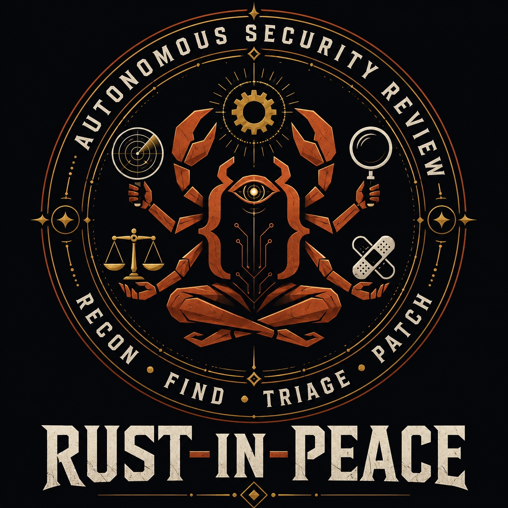

<p align="center">
  
</p>

# rust-in-peace 🦀🤘

**Agentic application security testing, developed through Rust vulnerability research.**

rust-in-peace combines several ways of looking at code with adversarial review,
targeted reproduction, and patch verification. It investigates memory safety,
protocol state, resource accounting, authorization, and API contracts. Rust is
the primary target; memory corruption is one part of the problem.

The repository contains **interactive research skills** and a **sandboxed
execution pipeline**, plus the rules, experiments, and failure records used to
develop them. Research workflows cover more than the autonomous CLI: protocol
and logic findings often need a target-specific test and an explicit security
invariant to check.

[](LICENSE)

[Start a review](#start-a-review) · [Run the pipeline](#run-the-pipeline) ·
[Public research](#public-research) · [Documentation](#documentation)

## Choose the method for the target

A panic detector cannot tell you whether an authorization decision was correct.
The threat model identifies the target's layer, entry points, trust boundaries,
and capabilities before selecting a search or verification method.

| Surface | Questions to investigate | Useful evidence |
|---|---|---|
| Byte parsers, codecs, fonts, document formats | Can input defeat bounds, recursion limits, allocation limits, or progress? | A reproducer through the real parser; cargo-fuzz, ASan, Miri, panic or timeout signals |
| Protocols and state machines | Is a rule enforced on both sides? Can valid messages produce an invalid transition or unbounded retained state? | Real protocol sequences, guard comparisons, control-versus-attack tests |
| APIs, libraries, and agent tools | Do validation, authorization, and later use agree? Can safe callers violate an unsafe implementation's assumptions? | Contract tests, differential results, adversarial trait implementations, Miri or compile proofs |

The same crate can expose different attack surfaces in different products.
Review the consuming application's entry point, enabled features, configuration,
limits, and build profile. A dependency version alone does not establish impact.

See the [method-selection decisions](docs/DECISIONS.md) and
[protocol/API review lenses](docs/lenses/protocol-invariant.md).

## Search from several directions

The research front end uses four search modes:

| Mode | Starting material | Purpose |
|---|---|---|
| Blind | Source and a general security brief | Find classes the threat model did not anticipate |
| Threat-model-first | Entry points, capabilities, and trust boundaries | Follow the paths that matter in the consuming system |
| History and variant analysis | Advisories, patches, and earlier confirmed or refuted candidates | Find sibling paths where a control is missing or behaves differently |
| SAST-driven | Static-analysis output grouped into review worklists | Enumerate sites and test hypotheses that source review may have missed |

`/variant-scan` runs the first three modes, merges their candidates, and assigns
skeptical reviewers to correctness, reachability, and impact. Finder contexts
must stay separate: reading a sibling's answer destroys the independence being
measured. The union retains single-pass discoveries; vote counts guide triage.
A unanimous panel of agents can still be wrong.

Within a pass, lenses ask specific questions: compare client with server, send
with receive, and offered values with accepted ones; follow a limit through
alternative paths; compare a successful control with a one-variable attack.
The target's own test helpers often provide the shortest route to a deep state.

`/sast-driven` stays separate so its contribution remains visible. It groups tool
hits into cells, prioritizes them for reachability review, then asks a finder to
inspect the source. The tool layer includes OpenGrep, ast-grep, Clippy, Dylint,
cargo-audit, and cargo-geiger, with optional operator-supplied CodeQL. Shipped
rules provide site inventories and reusable patterns from earlier research.
Run manifests record which engines actually ran; the workflow records unread
cells and per-rule yield. An absent engine is a coverage gap.

Details: [variant analysis](docs/variant-analysis.md),
[SAST design](docs/sast-layer.md), [SAST tooling](docker/sast/README.md), and
[rule expressibility across engines](docs/finding-class-map.md).

## Turn candidates into evidence

The execution pipeline provides several mechanisms for testing a claim:

- **Fresh-container grading.** A separate agent replays the submitted PoC in a
  new container from the target image. The finder cannot carry its modified
  filesystem into the grader.
- **Rust capability routing.** `capabilities.json` controls the default run
  budget and admission to the byte-crash track. A logic-only target receives an
  evidenced skip in `routing.json`. The standalone `reattack` stage also uses
  capabilities to select a dynamic harness; other routing rows remain a design
  specification rather than fully automated stages.
- **Checks on declared evidence.** Grade-time gates can downgrade claims with
  missing dependency citations, missing reachability traces, or a reproducer
  that bypassed the real entry point. Selected instrumentation-dependent crash
  classes require a shipping-build re-test. These checks inspect fields supplied
  by the grader: omitted premises can bypass the corresponding checks, and a
  well-formed citation is not proof that its contents support the claim.
- **Finding-to-harness generation.** `reattack` dispatches candidates to Rust
  harness templates and an agent attempts to bind, build, and reproduce them.
  Available approaches include byte and grammar fuzzing, Miri, adversarial trait
  implementations, and compile proofs. The scorecard records reproductions and
  explicit reasons for non-reproduction, including missing tooling or build
  failures. Zero findings is a valid outcome; unexplained coverage is not.
- **Patch testing and re-attack.** `patch` checks application and rebuild,
  replays the original PoC, runs the configured tests, and launches a fresh
  attack against the patched target. These are bounded checks; the resulting
  diff still needs engineering review.
- **Adversarial pre-disclosure review.** `predisclose` asks a skeptical agent
  to challenge the mechanism, reachability, severity, and proposed fix. It writes
  a local review artifact. It does not implement the complete disclosure
  workflow: current-release/default-branch checks, duplicate research, and
  measured severity still require operator work.

Static review results, agent votes, dynamic observations, and downstream impact
are different kinds of evidence. Preserve those distinctions when reporting.
The [lessons](LESSONS.md) document cases where we failed to do so.

## Start a review

For source review, clone the repository and open it in Claude Code:

```bash
git clone https://github.com/scadastrangelove/rust-in-peace.git
cd rust-in-peace
claude
```

Then, in the interactive session:

```text
/threat-model bootstrap /path/to/crate
/variant-scan /path/to/crate
/triage /path/to/VARIANT-FINDINGS.json --repo /path/to/crate --fp-rules profiles/rust/fp-rules.txt
```

Use the findings path produced by the scan. `/threat-model` writes
`THREAT_MODEL.md` and the capability inventory; `/variant-scan` writes
`VARIANT-FINDINGS.json` and Markdown; `/triage` writes ranked dispositions and
their reasoning. These source-review skills read source and write artifacts
without building or executing the target. Surviving candidates still need
independent verification.

For a smaller first pass, use `/vuln-scan /path/to/crate/src --extra
profiles/rust/scan-extras.txt`. `/quickstart` explains the available workflows.
The SAST-driven mode has its own [container setup](docker/sast/README.md);
compilation-based analysis executes the crate's build scripts and proc macros.

Interactive skills are shipped for Claude Code and Codex. The autonomous
Python harness currently invokes **Claude Code's headless CLI**; another agent
backend requires an adapter.

## Run the pipeline

Start with `rust-canary`, a deliberately vulnerable parser with memory-safety,
panic, and hang cases. Its shipped build targets Linux x86-64. Use a Linux
Docker host with Python 3.11+, permission to configure gVisor, and Claude API
access. The setup script installs/registers `runsc`, builds the shipped target
and agent images, and configures the egress proxy; it needs sudo and network
access during setup.

```bash
python3 -m venv .venv
source .venv/bin/activate
python -m pip install -e .

# Set real values for your provider and model before setup.
export ANTHROPIC_API_KEY='your-api-key'
export VULN_PIPELINE_MODEL='your-model-id'
./scripts/setup_sandbox.sh

# A small first batch: recon, find, fresh grade, streaming judge and report.
bin/vp-sandboxed run rust-canary \
  --runs 3 --parallel --stream --auto-focus --aggregate union --accept-dos
```

`--accept-dos` includes the canary's panic and hang findings; without it the
finder prioritizes memory corruption and may keep searching past plain DoS.
`--runs 3` sets an explicit budget; omitting it uses the Rust capability budget.
OAuth, Bedrock, and Vertex setup is documented in the
[agent sandbox guide](docs/agent-sandbox.md).

Inspect the batch directory printed by `run`. Streaming reports appear under
`reports/bug_NN/` as grades finish. Follow-up stages are separate commands:

```bash
# Replace <timestamp> with the directory printed by run.
RIP_RESULTS='results/rust-canary/<timestamp>'

bin/vp-sandboxed reattack "$RIP_RESULTS" --aggregate union
vuln-pipeline scorecard "$RIP_RESULTS"
bin/vp-sandboxed patch "$RIP_RESULTS"
bin/vp-sandboxed predisclose "$RIP_RESULTS"
```

`reattack` needs candidates from the batch or a compatible `--findings` JSON
list. It is not an automatic import of every research skill's output. `patch`
needs the target's `build_command` and uses its configured `test_command`.

| Artifact, relative to the batch | What to inspect |
|---|---|
| `run_NNN/result.json`, `poc.bin`, transcripts | The submitted trigger, grading result, and agent actions |
| `reports/bug_NN/report.json` | Mechanism, reachability, constraints, and severity argument |
| `reattack/scorecard.json` | Reproduction results and remaining verification gaps |
| `reports/bug_NN/patch.diff`, `patch_result.json` | Candidate fix and results of the verification tiers |
| `reports/bug_NN/predisclose.json` | Skeptical review of the proposed report and fix |

For a real target, supply a Dockerfile, `config.yaml`, and Rust capability
inventory under `targets/`. Pin the source and record its actual build and
entry point. See [adding targets](targets/README.md) and
[customization](docs/customizing.md).

## The agent is also an attack surface

Target source, build scripts, generated harnesses, and tool output are untrusted.
The autonomous CLI uses gVisor containers with allowlisted API egress through
`bin/vp-sandboxed`. The SAST runner separates dependency fetching from offline
analysis and records its actual isolation mode in the run manifest.

The project's [self-review](self-review/FINDINGS.md) found problems in its own
sandbox use, transcript handling, and trust boundaries. It records fixes and a
remaining architectural limitation: agent credentials share a container with
the target code the agent executes. An API egress allowlist does not isolate
those credentials from that code.

Read [security](docs/security.md) and [sandbox setup](docs/agent-sandbox.md)
before executing targets.

## Public research

The [public disclosure record](DISCLOSURES-PUBLIC.md) links reports, fixes, and
their recorded status. Selected cases show different parts of the method:

| Case | What it illustrates |
|---|---|
| [h2 state accounting](https://github.com/hyperium/h2/pull/936) and [Deno integration](https://github.com/denoland/deno/pull/36327) | A library defect's reachability depends on the consumer's protocol configuration |
| [rustls QUIC checks](https://github.com/rustls/rustls/pull/3173) | Comparing enforcement across protocol roles and negotiated parameters |
| [image BMP allocation fix](https://github.com/image-rs/image/pull/3095), following a Chromium report and [rolled into Chromium](https://issues.chromium.org/issues/537617325) | Tracing a vendored dependency to its upstream, fixing it there, and following the fix back down into the consumer |
| [ttf-parser hardening](https://github.com/harfbuzz/ttf-parser/pull/224) — seven merged fixes | History and variant analysis: seeding from earlier fixes to reach sibling paths (argument-stack underflow, integer overflow, exponential blowups) an existing control missed |

Research also produced a [Rust Binder patch carrying the maintainer's Reviewed-by](https://patchew.org/linux/20260828090757.96282-1-scadastrangelove@gmail.com/).
The record includes rejected hypotheses, corrected claims, and reporting
mistakes. A merged patch still has to reach a release and its consumers.
Software maintenance continues to obey gravity.

## Documentation

| Topic | Read |
|---|---|
| CLI stages, flags, resume, and artifacts | [Pipeline](docs/pipeline.md) |
| Rust detectors and execution routing | [Rust profile](profiles/rust/README.md), [capabilities](profiles/rust/capabilities.md), [find-to-fuzz](profiles/rust/find-to-fuzz.md) |
| Review and remediation | [Triage](docs/triage.md), [patching](docs/patching.md) |
| Experiments and failure analysis | [DVRA benchmark](targets/dvra3-parser/README.md), [lessons](LESSONS.md), [SAST bring-up](docs/case-studies/sast-driven-bringup.md) |
| Design and development | [Decisions](docs/DECISIONS.md), [extending](docs/extending.md), [backlog](IMPROVEMENTS.md), [changelog](CHANGELOG.md) |
| Operational problems | [Troubleshooting](docs/troubleshooting.md) |

The profile registry defaults to `rust`. The inherited C/C++ + ASan examples
remain available as `cpp`. The [Android app profile](profiles/android-app/README.md)
is experimental; its evidence model is not yet integrated throughout the shared
grade/aggregate/reattack lifecycle.

Contributions are welcome. For harness changes, install the development
dependencies with `python -m pip install -e '.[dev]'` and run `pytest tests/`.
The unit suite does not require Docker. Documentation changes can be checked
with `python scripts/check_markdown_links.py`.

## Origins, license, and contact

rust-in-peace builds on Anthropic's
[defending-code-reference-harness](https://github.com/anthropics/defending-code-reference-harness),
which provided the original C/C++ find/grade/report/patch loop and sandbox
architecture. This repository develops the Rust profiles, research workflows,
capability routing, SAST integration, and evidence checks described above.
Apache-2.0; upstream copyright and license are retained. See [LICENSE](LICENSE).

Maintained by **Sergey Gordeychik**:
[email](mailto:scadastrangelove@gmail.com) ·
[X / @scadasl](https://x.com/scadasl) ·
[SCADA StrangeLove blog](https://scadastrangelove.blogspot.com/).
