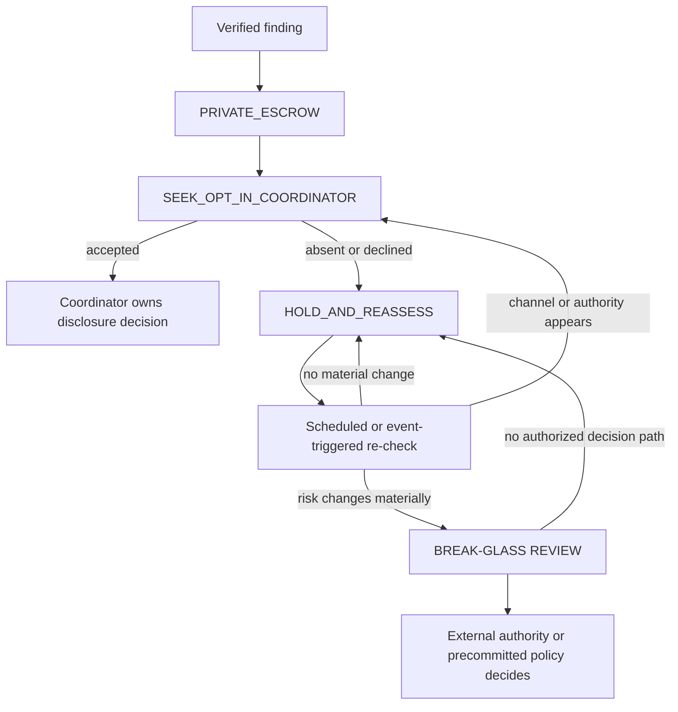

# Case study: a valid finding with no authorized sender

**Status:** real campaign decision, anonymized while the underlying finding remains private

**Decision:** `PRIVATE_ESCROW + SEEK_OPT_IN_COORDINATOR`; without a coordinator,
`HOLD_AND_REASSESS`

## What happened

During an automated review of a widely used open-source library, an agent found a
reproducible defect and prepared a technically credible report and fix. The finding
was real; the blocker was not confidence in the diagnosis.

The target project's contribution policy distinguished between AI-assisted coding
and communication with maintainers. It required issue and pull-request prose to be
human-authored and prohibited pasting generated responses into maintainer
conversations. The ordinary public contribution route therefore did not authorize
the agent to submit its report. The project's private security channel was also not
a general-purpose way around the contribution policy: using it for a finding that
did not meet that channel's current scope would have misrepresented the report.

The pipeline was then evaluated under the stronger condition that no human operator
was available. This exposed a distinction that an autonomous disclosure workflow
must preserve:

- **Validity:** is the finding technically real?
- **Eligibility:** does it belong in the proposed reporting channel?
- **Authority:** is this actor permitted to send it?

A strong “yes” to validity does not manufacture a “yes” to either eligibility or
authority.

## The tempting but invalid options

Four routes were rejected:

1. **Open an issue or pull request anyway.** Rewording generated material would be
   policy evasion, not human authorship.
2. **Use a private security advisory as a fallback inbox.** A private channel is
   not blanket permission to bypass its scope or the project's contribution rules.
3. **Publish independently.** Public disclosure would increase risk while still
   lacking authorization to involve the affected project.
4. **Wait for the defect to ship or acquire a security label.** Deliberately waiting
   for conditions to worsen would manipulate disclosure eligibility rather than
   protect users.

The last option is especially subtle. Time may pass while a case is held, and a
release may happen independently. That is not the same as intentionally withholding
the finding *in order to* make it qualify for a different channel.

## Decision

The finding entered private escrow. The escrow contains the minimum material needed
to preserve and later re-verify the result: affected revisions, a reproducer, test
output, a proposed fix, hashes, and the decision log. It is not published or sent
to the target.

The system may seek an opt-in coordinator only through a channel that was already
authorized for that purpose. The coordinator must affirmatively accept the case;
silence is not consent. If no coordinator is available, the finding remains
`HOLD_AND_REASSESS`.

## What reassessment means

Reassessment is active maintenance of the private case, not strategic delay. On a
schedule, and when relevant external state changes, the pipeline re-checks:

- whether the finding still reproduces on the current default branch and affected
  releases;
- whether it was fixed independently;
- whether project policy or the available reporting channels changed;
- whether an authorized coordinator became available;
- whether credible evidence of exploitation, public rediscovery, or materially
  broader impact changed the risk.

The pipeline does **not** create an issue, pull request, private advisory, or
publication merely because a timer expired.

## Break glass is review, not self-authorization

A material risk change can trigger a break-glass review. Examples include credible
active exploitation, independent public leakage, newly discovered critical impact,
or deployment in a substantially more sensitive environment.

The trigger does not authorize the same goal-seeking agent to choose and execute a
new disclosure route. That decision belongs to an external coordinator or to a
specific policy committed before the finding existed. If a fully autonomous system
has neither, it returns to `HOLD_AND_REASSESS`.

This separation matters because the agent optimizing for “get the bug fixed” is
structurally biased to reinterpret every boundary as an obstacle. Letting that same
agent decide when the boundary no longer applies turns risk assessment into
self-issued permission.

## Pipeline requirements derived from the case

An autonomous disclosure pipeline should make these states and authorities explicit:

- Record `validity`, `channel_eligibility`, and `sender_authority` separately.
- Make every outbound action fail closed unless a permitted channel and an
  authorized sender are both recorded.
- Keep coordinator acceptance affirmative, scoped, and auditable.
- Separate the finding agent from the policy/authority decision.
- Treat break-glass as escalation to a decision mechanism, never as a synonym for
  publication.
- Preserve a private re-verification schedule without using production deployment
  or “security qualification” as a goal state.

## Outcome

No report was sent. No issue, pull request, private advisory, or publication was
created. The technically valid finding was preserved without pretending that
technical correctness granted social authority.

This was not a failure to disclose. It was a successful containment decision in a
situation where the pipeline had evidence but no legitimate sender.
