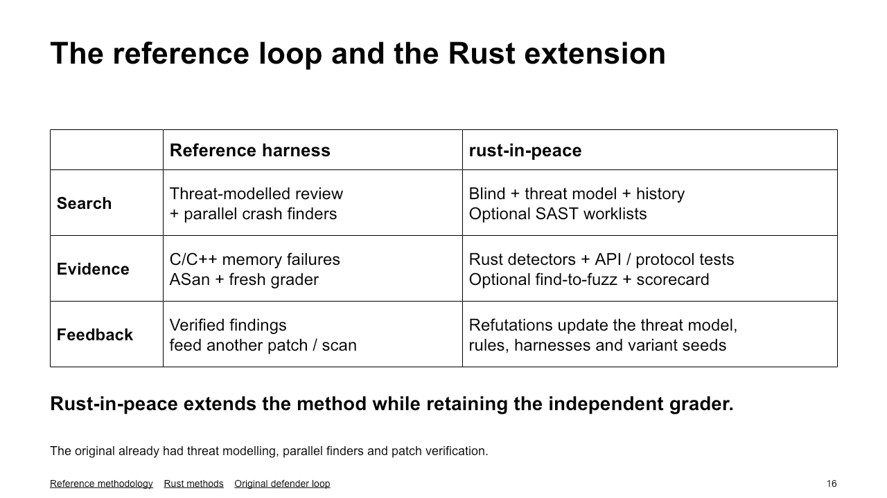
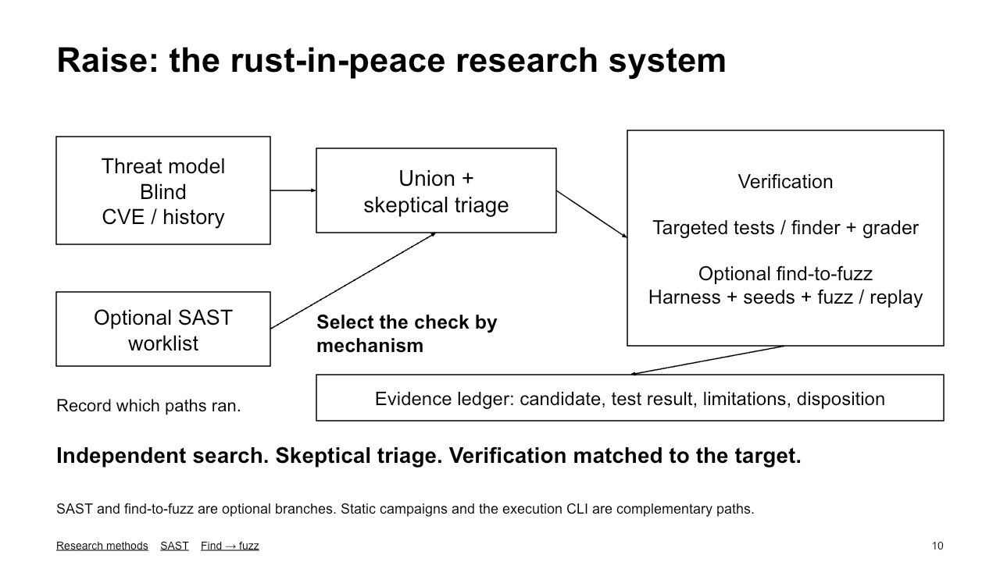
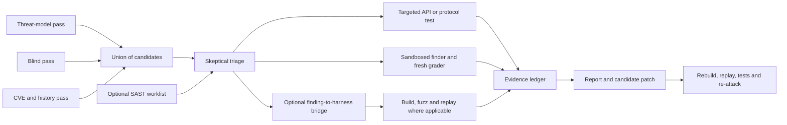
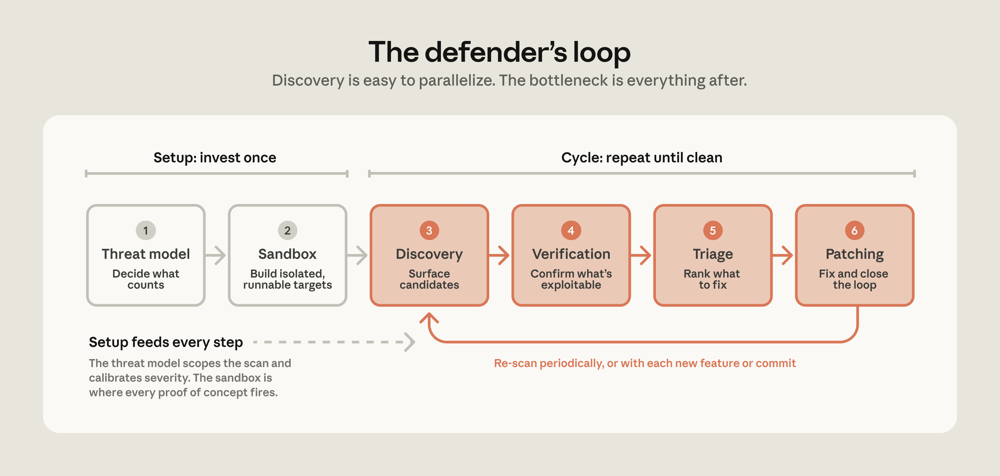
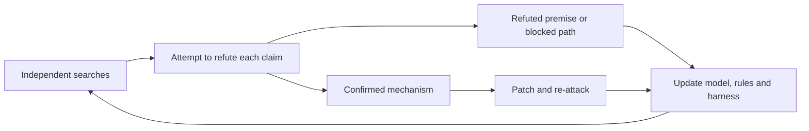

# The reference harness and rust-in-peace

rust-in-peace extends Anthropic's [Defending Code Reference Harness](https://github.com/anthropics/defending-code-reference-harness). The reference already provides threat modelling, static source review, parallel crash finders, fresh-container grading, reporting and patch verification. Those are inherited foundations.

The extension grew through Rust research: independent search contexts, different failure oracles, tests of protocol and API invariants, and explicit records of rejected candidates. The comparison below describes the research system, which includes both interactive workflows and the autonomous execution CLI. It does not imply that every historical campaign ran every stage.

| Area | Reference harness | Rust-in-peace extension |
|---|---|---|
| Search | Threat-modelled static review and parallel execution finders | Independent blind, threat-model and CVE/history passes, followed by union and adversarial triage |
| SAST | Not the defining execution mechanism | Optional, isolated worklists from static tools; record tool coverage, grouped signals and findings discovered while refuting them |
| Evidence | C/C++ memory-error discovery with ASan, followed by independent reproduction | Capability-routed Rust checks and targeted API/protocol tests; match the observable failure to the claim |
| Fuzzing | Agents construct and test inputs during crash discovery | Optional finding-to-harness bridge; bind a real API, seed and build, then fuzz and replay where supported |
| Trust boundary | Fresh grader container receives the PoC rather than the finder's modified filesystem | Retained boundary; check dependency citations, reachability and applicable shipping-build conditions |
| Feedback | Verified findings inform patching and subsequent scans | Confirmations and refutations also update threat models, rules, harnesses and variant seeds |

## The research system

The agent guides the experiment by selecting an entry point, harness template and seeds. Coverage feedback guides libFuzzer within the resulting byte or grammar harness. Some claims instead need Miri, an adversarial API implementation, a compile proof or a protocol sequence. A clean bounded run is evidence about that run, not a general security guarantee.

The standalone `reattack` finding-to-harness bridge and the `patch` verification ladder's re-attack are distinct operations. The former attempts to reproduce findings through generated harnesses; the latter attacks a proposed fix.

## The inherited loop and the added feedback

The original conceptual illustration remains useful:

The Rust workflow makes the feedback from unsuccessful hypotheses explicit:

Keep the next blind context independent of sibling answers when measuring the contribution of each search method. A campaign ledger can retain the earlier evidence without injecting those answers into every finder.

## Sources and scope

- [Upstream reference README](https://github.com/anthropics/defending-code-reference-harness/blob/main/README.md), inspected 27 September 2026. The retained [original execution diagram](../static/harness-diagram.png) is a historical C/C++/ASan illustration and does not establish the current sandbox configuration by itself.
- [Current research methods](../README.md), [variant analysis](variant-analysis.md) and [SAST layer](sast-layer.md).
- [Finding-to-fuzz bridge](../profiles/rust/find-to-fuzz.md), [public DVRA-003 record](../targets/dvra3-parser/README.md) and [patch verification](patching.md).
- [Sandbox boundary](agent-sandbox.md) and [research lessons](../LESSONS.md).

The PNGs are exported from editable presentation objects. The Mermaid diagrams above remain editable in the repository. This document does not rank model families, claim complete recall or treat agent agreement as independent proof.
